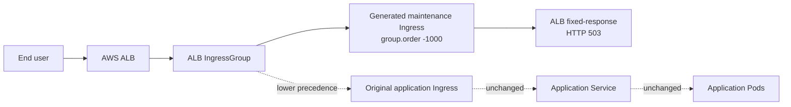
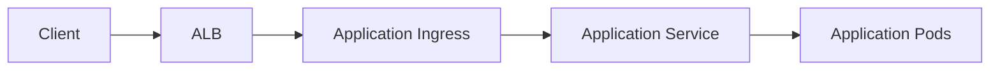
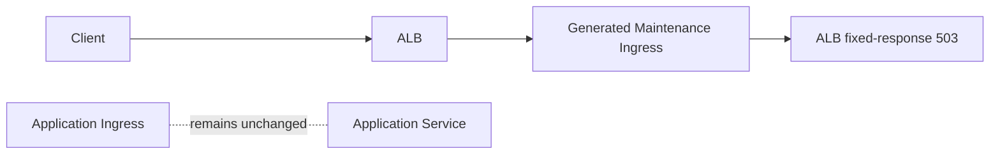

# Architecture

`app-maintenance-operator` is an ALB maintenance operator for Kubernetes. It helps platform teams enable scheduled AWS ALB maintenance pages through Kubernetes custom resources while leaving application-owned Ingress objects untouched.

Start with the [project README](../README.md) for installation and usage, or open the [GitHub Pages documentation](https://k8s-operators-devops.github.io/app-maintenance-operator/) for the public landing page.

> **Architecture principle:** Route AWS ALB Ingress traffic to a maintenance response with a high-priority ALB listener rule while preserving existing application Ingress routing, redirects, and backend rules.

## At a Glance

The operator gives the ALB a higher-priority maintenance rule without rewriting the application team's Ingress. This is the core architectural value: maintenance routing is isolated from application routing ownership.

## Problem Statement

ALB-backed Kubernetes applications often need a temporary maintenance response during planned change windows, platform migrations, dependency outages, or controlled release activities. The risky approach is to edit application Ingress rules or ALB listener rules directly. That couples maintenance operations to production routing and increases the blast radius of a routine operational task.

This operator solves that problem by keeping maintenance intent in Kubernetes and using reconciliation to manage a generated overlay Ingress. AWS Load Balancer Controller converts that overlay into the ALB listener rule that serves the maintenance response.

## Kubernetes-Native Advantages

- The `Maintenance` custom resource is the declarative source of truth for maintenance intent.
- The controller reconciles generated resources instead of relying on manual ALB console changes.
- Application-owned Ingress objects remain stable and auditable.
- Scheduled windows are represented in Kubernetes API state through `spec.schedule`.
- Finalizers give the controller a chance to clean up generated resources before deletion completes.

## Maintenance Custom Resource

The `Maintenance` custom resource is the operator API for enabling or disabling maintenance mode for an ALB IngressGroup. The recommended targeting field for AWS Load Balancer Controller users is `spec.albGroupName`; direct Ingress-name targeting is also supported through `spec.targetIngress`.

The ALB IngressGroup must already exist through one or more AWS Load Balancer Controller-managed Ingresses.

## Reconciliation Flow

When a `Maintenance` resource is created or updated, the controller:

1. Adds a finalizer to the `Maintenance` resource.
2. Builds the fixed-response ALB action from `spec.response`.
3. In group mode, discovers existing same-namespace IngressGroup members, resolves their listener ports, and creates or reconciles a standalone catch-all maintenance Ingress for `spec.albGroupName`.
4. When targeting by Ingress name, reads the target Ingress for ALB metadata, validates it, creates a one-time backup ConfigMap, and creates a standalone catch-all maintenance Ingress.
5. Updates status phase, message, and the standard `Ready` condition.

On disable, the controller deletes the generated maintenance Ingress and any backup ConfigMap from Ingress-name targeting. It does not patch, replace, or restore the original application Ingress.

On deletion, the controller deletes the generated maintenance Ingress first, waits until it is gone, deletes any owned backup ConfigMap, and then removes the finalizer.

## Overlay Ingress Model

The operator uses an overlay model. The application Ingress remains the business-owned routing object. The maintenance Ingress is a temporary operator-owned object that joins the same ALB group and takes precedence. AWS Load Balancer Controller reconciles that generated Ingress into a higher-priority ALB listener rule.

> **Key point:** Maintenance mode is implemented as an overlay listener rule, not by rewriting application-owned Ingress routes.

This model avoids a risky anti-pattern: mutating production application routing state and later attempting to restore it from a backup. In cloud operations, that kind of restore logic is a sharp edge. The operator keeps the application Ingress read-only during normal enable and disable.

## ALB IngressGroup Behavior

AWS Load Balancer Controller merges Ingresses with the same `alb.ingress.kubernetes.io/group.name` into one ALB rule set. Lower `alb.ingress.kubernetes.io/group.order` values take precedence.

The generated maintenance Ingress:

- uses `spec.albGroupName` directly, or copies the target Ingress group name when `spec.targetIngress` is used;
- sets `alb.ingress.kubernetes.io/group.order: "-1000"`;
- sets `alb.ingress.kubernetes.io/listen-ports` from the discovered ALB group listener ports;
- creates a single catch-all `/*` fixed-response rule;
- removes inherited ALB action annotations;
- removes target-group-specific health check/backend annotations;
- adds only `alb.ingress.kubernetes.io/actions.maintenance`;
- becomes a higher-priority ALB listener rule through AWS Load Balancer Controller reconciliation.

## Normal Traffic Flow

## Maintenance Traffic Flow

## Watches

The controller watches:

- `Maintenance` resources;
- owned backup ConfigMaps created for Ingress-name targeting;
- owned generated maintenance Ingresses;
- target Ingress changes filtered by the `spec.targetIngress` field index.

Owned Ingress watches repair drift or manual deletion of the generated maintenance Ingress. Target Ingress watches allow Ingress-name maintenance overlays to be reconciled when the source application Ingress changes.
